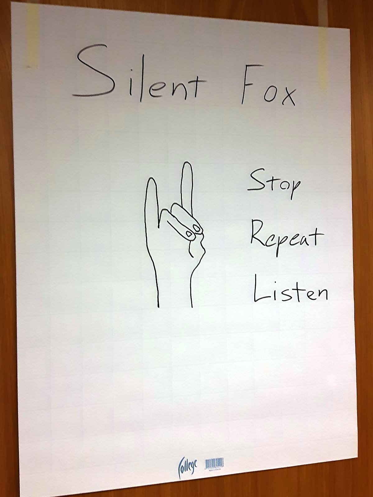

# HSL Developer Day 2018

During the day, we handled planning in Cryptpad with invitations via a tinyurl.com URL.

Remote attendance was possible at https://meet.jit.si/hsl-developer-day-2018-big-room . You were asked to add your name if you joined.


## Eventual outline

```
09:00 HSL: Introduction

09:10 Lightning talks 1-4
09:45 BREAK
09:55 Lightning talks 5-9
10:50 BREAK
11:00 Lightning talks 10-13

11:50 Lunch

13:00 HSL: Collaboration introduction
13:15 Collaboration discussion
13:40 BREAK
13:50 Collaboration discussion continues
14:20 BREAK
14:30 Open space and feedback
15-17 People start to leave
```

## Methods for the day

<p float="left">
  
  
</p>


## Lightning talks in order

1. HSL: Transitlog
   <p float="left">
     
     
   </p>

1. Entur: Tiamat/Abzu (national stops register)
   <p float="left">
     
   </p>

1. Ruter: Ruter's Digital Platform (RDP) - Event-/data driven platform based on Apache Kafka
   <p float="left">
     
   </p>

1. Samtrafiken: Open Data, National Access Point
   <p float="left">
     
   </p>

1. HSL: Reimagining Jore
   <p float="left">
     
   </p>

1. Entur: Anshar (real-time HUB)
   <p float="left">
     
   </p>

1. HSL: GTFS Realtime via Apache Pulsar
   <p float="left">
     
   </p>

1. Entur: Chouette (Timetable database)
   <p float="left">
     
   </p>

1. Entur: Flexible transport

1. Samtrafiken: BoB

1. Entur: OpenTripPlanner 2.0
   <p float="left">
     
   </p>

1. Ruter: More on architecture
   <p float="left">
     
   </p>

1. HSL: Digitransit


## Collaboration enabling workshop

   <p float="left">
     
     
     
   </p>

Each organization picks an open and active project to document openly.
Create a landing page for the project in a new GitHub repository with a `README.md` if no other landing page exists already.
Work in small groups to find the pain points of the current documentation.

### Definition of Done for the documentation:

- have a (version-controlled) central point of documentation for your project, a landing page
    - create a github repo, e.g. ruter/kapp, ruter/kapp-doc or similar
    - content:
        - what is the scope of the project?
        - what is the status of the project?
        - where is the issue board? link to it
        - what are the responsibilities of the software components? in one sentence each.
        - where is the source code? link to the different components
        - how to deploy it all?
- anyone can file issues for the components
    - someone else than the owner should create an issue for the documentation repo, e.g. for improving the documentation
    - fix the issue right away
- write down the UTC time interval for the sprint demo. Add a https://meet.jit.si link or a similar remote call link, like at the top of this document. Jitsi does not require any authentication.

### An example

We worked through an example together: https://github.com/HSLdevcom/transitlog


## Useful resources for remote collaboration

- Practical advice on running an open source project: https://producingoss.com/
- Checklist for running a project responsibly: https://github.com/coreinfrastructure/best-practices-badge/blob/master/doc/criteria.md
- The manifesto for remote work has useful ideas: https://www.remoteonly.org/
- GitLab as a remote-only company pushes a lot of their internal discussions online to foster trust in the community and to get early feedback


## Feedback

### What worked nicely?

- project introductions and status
- [common project documentation template](https://github.com/HSLdevcom/transitlog)
- developers met face to face
- count and duration of breaks
- facilitation

### What could we try in the next Developer Day?

- focus more on:
  - organizational context and business needs
  - architectural reasoning and discussion
  - technical themes
- have more hands-on technical workshops, for example on:
  - GTFS mapping to/from other formats
  - static data updates in OTP
  - geocoder work (Pelias?)


## Some of the Cryptpad contents before and during the workshop

### What?

HSL Developer Day 2018 gathers together developers and techies from HSL, Samtrafiken, Ruter and Entur.


### Why?

We found out that our projects overlap in scope and in architecture.
It looks like there is potential for collaboration.

We need to figure out what is going on in each relevant project and how can we collaborate remotely.
Let's get to know each other and look for some answers face-to-face.


### Where?

The address is Opastinsilta 6 Ak, Helsinki.

The streets of East Pasila neighbourhood are built on two levels. The lower level is mainly for busses, trams and cars. The upper level is mainly for pedestrians and cyclists. Our venue at the HSL headquarters is called Seutusali and has a separate entrance in the inner yard on the upper level.

Here's a Digitransit link that will guide you to the right door: https://www.reittiopas.fi/reitti/Airport%2C%20Vantaa%3A%3A60.316357%2C24.969138/Opastinsilta%206%20Ak%2C%20Helsinki%3A3A60.199408%2C24.94087?arriveBy=true&time=1536126300 .


### When?

On Wednesday 2018-09-05. All times are in local Finnish time. (09:00 Finnish time is 08:00 Swedish time.)

The outline below is malleable and may be changed during the day multiple times.


### FAQ

#### Do I need to prepare somehow?

For each relevant project, please prepare a 300-second lightning talk as a team.
No slides, please!
Instead, you will have markers, a flip board and a demo screen at your disposal.
The team members can work in parallel.

An example structure for the lightning talks:
- Who are we?
- What is the scope and status of the project?
- What is the general design?
- What is the tech stack? Languages/services/products/libraries?


#### What might people present in the lightning talk section?

If the projects cross organizational boundaries already, just ignore the division into organizations below.

HSL:
- [x] Transitlog
- [x] GTFS Realtime via Apache Pulsar
- [x] Reimagining Jore
- [x] Digitransit

**Please fill your own topics if you know them already.**

Samtrafiken:
- [x] BoB
- [x] Open Data, National Access Point?

Ruter:
- [x] Ruter's Digital Platform (RDP) - Event-/data driven platform based on Apache Kafka (According to HSL sounds like combining the scope of HSL's Transitlog and Operational Monitoring & Management (OMM) :) )
- [x] More on architecture

Entur:
- [x] Open Trip Planner 2.0
- [x] Tiamat/Abzu (national stops register)
- [x] Anshar (real-time HUB)
- [x] Chouette (Timetable database) - if there 's demand
- [x] Flexible transport


#### How do I move around in Helsinki?

In the central Helsinki you can ride the city bikes which require registration and payment before use: https://kaupunkipyorat.hsl.fi/en .

For public transit, you can buy tickets with the HSL mobile app for Android and iOS.
Consider the daily tickets.

The HSL Digitransit deployment, Reittiopas, can route the city bikes as well: https://www.reittiopas.fi/ .
</div>
